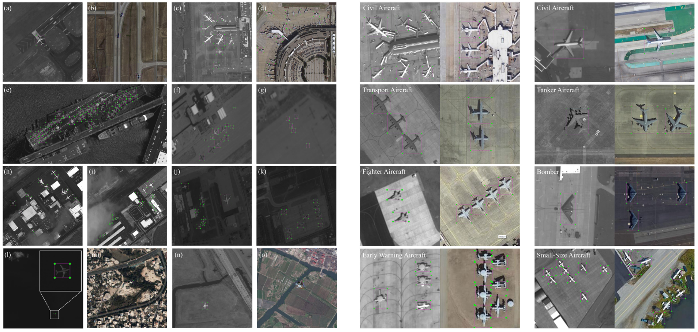
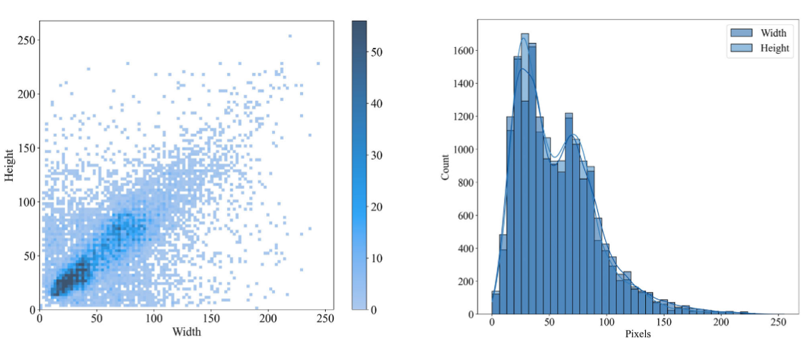

# [TGRS 2023] CORS-ADD: Complex Optical Remote-Sensing Aircraft Detection Dataset

**CORS-ADD** is a complex optical remote-sensing aircraft detection dataset designed for robust aircraft detection under diverse data sources, complex scenes, multiple aircraft types, and challenging imaging conditions.

Different from many aircraft datasets collected from a single platform or typical airport scenes, CORS-ADD integrates imagery from **Google Earth and multiple satellite sensors**, including WorldView-2, WorldView-3, Pleiades, Jilin-1, and IKONOS. It covers not only common apron and runway scenes, but also aircraft carriers, ocean and land scenes with flying aircraft, cloud interference, low dynamic range, and degraded imaging conditions.

<p align="center">
  
</p>

<p align="center">
  <em>Representative complex scenes and aircraft samples from CORS-ADD.</em>
</p>

---

## Release Scope

This repository publicly releases the CORS-ADD dataset for aircraft detection in optical remote-sensing images.

**Released:**

* CORS-ADD with oriented bounding boxes, OBBs
* CORS-ADD with horizontal bounding boxes, HBBs
* Image patches for training and evaluation
* Detection annotations

**Recommended version:**

We recommend using the **OBB version** for research and evaluation.

> **Important note:**
> The HBB and OBB releases are not exactly the same. The OBB version is more carefully checked and contains fewer known annotation issues. Unless otherwise specified, the statistics and descriptions in the paper mainly refer to the OBB setting. The HBB version is provided only for convenience and is not recommended as the primary version.

---

## Highlights

* **Multi-source and complex scenes**
  CORS-ADD is collected from Google Earth and multiple satellite sensors with different imaging characteristics. It covers typical airports, aircraft carriers, ocean and land scenes with flying aircraft, cloud/fog interference, low dynamic range, and degraded imaging conditions.

* **Diverse aircraft targets and scales**
  The dataset contains both civil and military aircraft, including civil aircraft, fighters, bombers, transport aircraft, tanker aircraft, early-warning aircraft, and small-size aircraft. Aircraft instances range from **4 × 4 to 240 × 240 pixels**.

* **Carefully labeled oriented annotations**
  The recommended OBB version follows the DOTA-style annotation format and is suitable for oriented aircraft detection in remote-sensing images. HBB annotations are also provided for compatibility with common horizontal detectors.

---

## Dataset Statistics

| Item                               | Description                                                       |
| ---------------------------------- | ----------------------------------------------------------------- |
| Dataset name                       | CORS-ADD                                                          |
| Task                               | Aircraft object detection                                         |
| Image type                         | Complex optical remote-sensing images                             |
| Data sources                       | Google Earth, WorldView-2, WorldView-3, Pleiades, Jilin-1, IKONOS |
| Number of large-scale images       | 158                                                               |
| Average size of large-scale images | 8234 × 7070 pixels                                                |
| Number of image blocks             | 7,337                                                             |
| Image block size                   | 640 × 640 pixels                                                  |
| Number of aircraft instances       | 32,285                                                            |
| Target scale range                 | 4 × 4 to 240 × 240 pixels                                         |
| Recommended annotation type        | Oriented Bounding Boxes, OBBs                                     |
| Recommended annotation format      | DOTA-style format                                                 |
| Auxiliary annotation type          | Horizontal Bounding Boxes, HBBs                                   |
| Auxiliary HBB formats              | YOLO format and COCO format                                       |
| Train/test split                   | 7:3                                                               |

<p align="center">
  
</p>

<p align="center">
  <em>Scale distribution and statistical analysis of aircraft instances in CORS-ADD.</em>
</p>

CORS-ADD is challenging because it contains multi-source imagery, complex airport and non-airport scenes, dense aircraft distributions, small targets, cloud/fog interference, low dynamic range, and degraded imaging conditions. These factors make aircraft detection more difficult than in simple airport-scene datasets.

---

## Data Sources and Construction

CORS-ADD is constructed from Google Earth and multiple satellite sensors. Different imaging platforms introduce different spatial resolutions, grayscale distributions, texture characteristics, imaging noise, and degradation patterns, making the dataset more suitable for evaluating model robustness.

The original large-scale remote-sensing images are manually annotated and then cropped into 640 × 640 image blocks. To reduce incomplete aircraft targets near patch boundaries, the large images are cropped with an overlap ratio of 0.25. Only patches containing aircraft targets are retained, and the annotations are transformed from the original large-scale image coordinates to the cropped patch coordinates.

---

## Annotation Format

### Recommended OBB format

For oriented bounding boxes, CORS-ADD follows the DOTA-style format:

```text
x1 y1 x2 y2 x3 y3 x4 y4 class_name difficult
```

where `(x1, y1), ..., (x4, y4)` denote the four vertices of the oriented bounding box.

### Auxiliary HBB formats

The HBB version is also provided for convenience and compatibility with horizontal object detectors. It includes both YOLO-style and COCO-style annotations.

**YOLO format**

```text
class_id x_center y_center width height
```

where the coordinates are normalized.

**COCO-style format**

```text
x1 y1 x2 y2 class_name
```

where `(x1, y1)` and `(x2, y2)` denote the top-left and bottom-right corners of the horizontal bounding box.

> **Note:** The HBB and OBB releases are not exactly the same. We recommend using the **OBB version**, which is more carefully checked and contains fewer known annotation issues.

---

## Download

The dataset is available for academic research only.

* Baidu Netdisk: [download link](https://pan.baidu.com/s/1cC4aIUWk8KyUhxWzsCU3eg)
  Extraction code: `3zpp`

* Google Drive: [download link](https://drive.google.com/drive/folders/1vijI1xeWLYH7eppcU7ytNQMQ6RPRcs7I?usp=drive_link)

Decompression password:

```text
Cors-add
```

The released files include:

```text
CORS-ADD-HBB.rar
CORS-ADD-OBB.rar
```

We recommend using:

```text
CORS-ADD-OBB.rar
```

---

## Usage License

CORS-ADD is released for **non-commercial academic research only**.

By downloading or using this dataset, you agree to the following terms:

1. The dataset may only be used for academic research.
2. Commercial use is prohibited.
3. The dataset may not be redistributed, sold, or used in commercial products or services.
4. Use of Google Earth imagery must follow the relevant Google Earth terms of use.
5. If you use CORS-ADD in your research, please cite our papers.

---

## Citation

If you use CORS-ADD in your research, please cite:

```bibtex
@article{shi2023complex,
  title={Complex optical remote-sensing aircraft detection dataset and benchmark},
  author={Shi, Tianjun and Gong, Jinnan and Jiang, Shikai and Zhi, Xiyang and Bao, Guangzhen and Sun, Yu and Zhang, Wei},
  journal={IEEE Transactions on Geoscience and Remote Sensing},
  volume={61},
  pages={1--9},
  year={2023},
  doi={10.1109/TGRS.2023.3283137}
}
```

```bibtex
@article{shi2025progressive,
  title={Progressive class-aware instance enhancement for aircraft detection in remote sensing imagery},
  author={Shi, Tianjun and Gong, Jinnan and Hu, Jianming and Sun, Yu and Bao, Guangzhen and Zhang, Pengfei and Wang, Junjie and Zhi, Xiyang and Zhang, Wei},
  journal={Pattern Recognition},
  volume={164},
  pages={111503},
  year={2025},
  doi={10.1016/j.patcog.2025.111503}
}
```

---

## Contact

For questions or feedback, please contact:

**Tianjun Shi**

Research Center for Space Optical Engineering, Harbin Institute of Technology
Email: [shitianjun@stu.hit.edu.cn](mailto:shitianjun@stu.hit.edu.cn)
